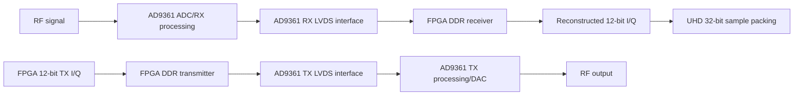
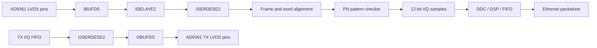

# AD9361–Artix-7 1R1T LVDS Simulation: Complete Explanation

## 1. What this simulation demonstrates

This simulation demonstrates the digital sample interface between:

```text
AD9361 RF transceiver ↔ Artix-7 FPGA
```

It models both directions:



The simulation covers only the digital section:

```text
AD9361 LVDS pins ↔ FPGA digital logic
```

It does not simulate:

- RF modulation or demodulation
- AD9361 analog ADC/DAC circuits
- LO generation
- Filters or gain control
- SPI register programming
- Ethernet or UHD network streaming

It assumes the AD9361 has already been configured through SPI for:

- LVDS operation
- DDR operation
- 1R1T mode
- Correct data-port order
- Correct clock/frame timing

---

# 2. Why the interface uses DDR

Each AD9361 I or Q sample is 12 bits, but the LVDS data interface has only six data pairs:

```text
RX_D[5:0]
TX_D[5:0]
```

Therefore, the interface cannot transfer a complete 12-bit word in one edge.

DDR means that data is transferred on both:

- Rising clock edge
- Falling clock edge

One clock cycle therefore carries two six-bit transfers.

A complex sample contains:

```text
12-bit I + 12-bit Q = 24 bits
```

Since six bits are transferred per clock edge:

\[
\frac{24\ \text{bits}}{6\ \text{bits/edge}}=4\ \text{clock edges}
\]

Therefore, one complex sample requires four DDR transfers.

---

# 3. 1R1T wire-transfer sequence

The modeled transfer order is:

| Phase | Data bus | Frame | Meaning |
|---:|---|---:|---|
| 0 | `I[11:6]` | 1 | Upper six I bits |
| 1 | `Q[11:6]` | 1 | Upper six Q bits |
| 2 | `I[5:0]` | 0 | Lower six I bits |
| 3 | `Q[5:0]` | 0 | Lower six Q bits |

Therefore:

```text
Wire order:    I upper → Q upper → I lower → Q lower
Frame pattern:    1    →    1    →    0    →    0
```

This is the `1100` frame pattern printed by the simulation.

The sequence was selected from the UHD 1R1T LVDS reference behavior, rather than being invented for this project.

---

# 4. Example transfer

Suppose the AD9361 produces:

```text
I = 12'h123
Q = 12'hABC
```

Binary representation:

```text
I = 0001_0010_0011
Q = 1010_1011_1100
```

Split into six-bit pieces:

```text
I[11:6] = 000100 = 0x04
I[5:0]  = 100011 = 0x23

Q[11:6] = 101010 = 0x2A
Q[5:0]  = 111100 = 0x3C
```

The physical transfer sequence becomes:

| Edge | `RX_FRAME` | `RX_D[5:0]` |
|---:|---:|---:|
| 0 | 1 | `0x04` |
| 1 | 1 | `0x2A` |
| 2 | 0 | `0x23` |
| 3 | 0 | `0x3C` |

The FPGA reconstructs:

```systemverilog
I = {6'h04, 6'h23};
Q = {6'h2A, 6'h3C};
```

Result:

```text
I = 12'h123
Q = 12'hABC
```

---

# 5. Files used in the simulation

## Behavioral FPGA model

[nyquist_ad9361_lvds_1r1t_demo.sv](F:/SDR/nyquist-sdr/Firmware/sim/ad9361_lvds_1r1t/rtl/nyquist_ad9361_lvds_1r1t_demo.sv)

This contains:

- RX DDR reconstruction
- RX frame checking
- Differential complement checking
- UHD sample packing
- TX sample latching
- TX DDR serialization
- Status counters

## Self-checking testbench

[tb_nyquist_ad9361_lvds_1r1t.sv](F:/SDR/nyquist-sdr/Firmware/sim/ad9361_lvds_1r1t/tb/tb_nyquist_ad9361_lvds_1r1t.sv)

This acts as:

- A simplified AD9361 RX-data generator
- An FPGA TX-output checker
- A differential-signal generator
- A frame-error injector
- An automatic pass/fail controller

This is important: the testbench does not only generate waveforms. It automatically calculates the expected results and reports failure if the design produces something different.

---

# 6. Receive-path mechanism

The simulated receive direction is:

```text
Testbench acting as AD9361
        ↓
RX_CLK_P/N
RX_FRAME_P/N
RX_D_P/N[5:0]
        ↓
FPGA receive state machine
        ↓
12-bit I and 12-bit Q
        ↓
UHD-compatible 32-bit packed word
```

## 6.1 Phase counter

The receive logic uses:

```systemverilog
logic [1:0] rx_phase;
```

It cycles through:

```text
0 → 1 → 2 → 3 → 0
```

Because it is two bits wide, it naturally wraps from 3 back to 0.

## 6.2 Both clock edges

The behavioral block responds to both clock edges:

```systemverilog
always @(posedge rx_clk_p or negedge rx_clk_p or posedge rst)
```

Therefore, a new six-bit word is captured at every transition of `rx_clk_p`.

This models DDR behavior.

It is deliberately behavioral. A production FPGA should not implement its physical DDR interface using this exact `always` block.

## 6.3 Partial sample registers

The receiver uses temporary registers:

```systemverilog
rx_i_work
rx_q_work
```

They accumulate the four transfers:

```systemverilog
phase 0: rx_i_work[11:6] = rx_d_p;
phase 1: rx_q_work[11:6] = rx_d_p;
phase 2: rx_i_work[5:0]  = rx_d_p;
phase 3: rx_q_work[5:0]  = rx_d_p;
```

At phase 3, the complete sample is available:

```systemverilog
rx_i = rx_i_work;
rx_q = rx_q_work;
rx_sample_valid = 1;
```

Thus, `rx_sample_valid` indicates:

> A complete I/Q pair has been reconstructed and may be consumed by downstream FPGA logic.

It is asserted for one transfer interval per completed sample.

---

# 7. Frame checking

The expected frame value is determined from the phase:

```systemverilog
expected_frame = (rx_phase < 2);
```

Therefore:

```text
phase 0 → expected frame 1
phase 1 → expected frame 1
phase 2 → expected frame 0
phase 3 → expected frame 0
```

If the received frame differs:

```systemverilog
if (rx_frame_p !== expected_frame)
    rx_frame_error_count = rx_frame_error_count + 1;
```

This detects:

- Wrong frame value
- Incorrect phase position
- Some forms of interface misalignment

The current design detects frame errors but does not automatically search for and reacquire frame alignment. Production logic should include a more complete synchronization/calibration mechanism.

---

# 8. Differential-signal checking

LVDS uses two wires for each signal:

```text
P = positive
N = negative
```

Ideally:

\[
N = \neg P
\]

The testbench generates:

```systemverilog
rx_clk_n   = ~rx_clk_p;
rx_frame_n = ~rx_frame_p;
rx_d_n     = ~rx_d_p;
```

The receiver checks:

```systemverilog
rx_clk_n   == ~rx_clk_p
rx_frame_n == ~rx_frame_p
rx_d_n     == ~rx_d_p
```

If any condition fails:

```systemverilog
rx_diff_error_count = rx_diff_error_count + 1;
```

This verifies the digital logical relationship between P and N.

It does not simulate physical LVDS properties such as:

- Differential voltage amplitude
- Common-mode voltage
- Termination resistance
- PCB trace impedance
- P/N skew
- Reflections
- Jitter or noise

Those require hardware measurements or signal-integrity simulation.

---

# 9. UHD-compatible sample packing

The AD9361 produces 12-bit I and Q values. UHD/B200-style FPGA logic stores them inside a 32-bit sample word:

```systemverilog
assign rx_packed = {rx_i, 4'b0000, rx_q, 4'b0000};
```

The layout is:

| Bits | Content |
|---|---|
| `[31:20]` | 12-bit I |
| `[19:16]` | Four zeros |
| `[15:4]` | 12-bit Q |
| `[3:0]` | Four zeros |

Diagram:

```text
31              20 19  16 15               4 3    0
+----------------+------+-------------------+------+
|   I[11:0]      | 0000 |     Q[11:0]       | 0000 |
+----------------+------+-------------------+------+
```

For example:

```text
I = 12'h100
Q = 12'hE00
```

produces:

```text
PACK = 32'h1000E000
```

This exact result appears in the XSim transcript:

```text
SAMPLE 00 RX I=100 Q=e00 PACK=1000e000
```

Effectively, each 12-bit sample is left-aligned inside a 16-bit field:

```text
16-bit host I = 12-bit I << 4
16-bit host Q = 12-bit Q << 4
```

---

# 10. Transmit-path mechanism

The transmit direction is:

```text
FPGA 12-bit I/Q input
        ↓
Latch complete sample
        ↓
Split into four six-bit sections
        ↓
Generate TX_FRAME pattern 1100
        ↓
TX_D_P/N[5:0]
        ↓
Testbench acting as the AD9361
```

## 10.1 Sample latching

At phase zero, a valid TX sample is copied into internal registers:

```systemverilog
if ((tx_phase == 0) && tx_sample_valid) begin
    tx_i_latched = tx_i;
    tx_q_latched = tx_q;
end
```

Latching prevents the input sample from changing while its four sections are being transmitted.

## 10.2 TX serialization

The four phases generate:

```systemverilog
phase 0: TX_FRAME=1, TX_D=I[11:6]
phase 1: TX_FRAME=1, TX_D=Q[11:6]
phase 2: TX_FRAME=0, TX_D=I[5:0]
phase 3: TX_FRAME=0, TX_D=Q[5:0]
```

At phase 3:

```systemverilog
tx_sample_count = tx_sample_count + 1;
```

This records one completed transmitted complex sample.

## 10.3 Differential outputs

The negative TX outputs are produced as complements:

```systemverilog
assign tx_frame_n = ~tx_frame_p;
assign tx_d_n     = ~tx_d_p;
```

The testbench verifies this relationship on every transfer.

## 10.4 Simplification

The demonstration generates:

```systemverilog
tx_clk_p = rx_clk_p;
tx_clk_n = rx_clk_n;
```

Therefore, RX and TX use the same simulated clock.

This is suitable for explaining serialization, but the production interface must implement the AD9361 transmit clocking arrangement correctly using FPGA clocking and output DDR resources.

The simulation also assumes:

- `tx_sample_valid` is asserted at the start of phase 0.
- `tx_i` and `tx_q` are stable when they are latched.
- A continuous stream is being transmitted.

Backpressure, FIFO underflow and burst termination are not modeled yet.

---

# 11. Testbench timing

Each `transfer_edge` operation does the following:

```systemverilog
Set RX data and frame
Wait 4 ns
Toggle RX clock
Wait 1 ns
Check TX output
Wait 5 ns
```

Therefore, clock transitions occur every:

\[
4+1+5=10\text{ ns}
\]

One full clock period is:

\[
T=20\text{ ns}
\]

The simulated clock frequency is therefore:

\[
f=\frac{1}{20\text{ ns}}=50\text{ MHz}
\]

Because data transfers on both clock edges:

\[
100\text{ million six-bit transfers/second}
\]

Four transfers are required per complex sample:

\[
\frac{100\text{ M transfers/s}}{4}
=25\text{ M complex samples/s}
\]

So this particular testbench timing corresponds to 25 MS/s.

This is only the selected simulation rate. It is not a claim about the maximum AD9361 or FPGA rate.

---

# 12. Test vectors

The testbench sends 16 RX samples.

RX values:

```text
I = 0x100 through 0x10F
Q = 0xE00 through 0xE0F
```

TX values:

```text
I = 0x300 through 0x30F
Q = 0xC00 through 0xC0F
```

Using different RX and TX number ranges makes it easier to identify:

- RX/TX mixing
- Incorrect I/Q ordering
- Missing samples
- Bit corruption
- Repeated samples

If I and Q were accidentally swapped, the checker would immediately report an error.

---

# 13. RX automatic checker

After four transfers, the testbench checks:

## Sample-valid signal

```systemverilog
if (!rx_sample_valid)
    error;
```

## Reconstructed sample

```systemverilog
if (rx_i != expected_rx_i)
    error;

if (rx_q != expected_rx_q)
    error;
```

## Packed UHD word

```systemverilog
if (rx_packed != expected_packed)
    error;
```

The RX sample is counted as correct only if reconstructed I and Q match exactly.

---

# 14. Independent TX checker

The TX checker observes what the DUT produces on `tx_d_p`.

It reconstructs the transmitted sample independently:

```text
phase 0 → TX I upper
phase 1 → TX Q upper
phase 2 → TX I lower
phase 3 → TX Q lower
```

It then compares the reconstructed data against:

```text
expected_tx_i
expected_tx_q
```

It also checks on every edge:

- `TX_FRAME = 1100`
- `TX_CLK_N = NOT TX_CLK_P`
- `TX_FRAME_N = NOT TX_FRAME_P`
- `TX_D_N = NOT TX_D_P`

This independent reconstruction is important. The testbench does not simply trust the internal DUT signals.

---

# 15. Nominal test

In the normal test:

```text
Fault injection enabled: 0
```

The expected final conditions are:

```text
rx_sample_count = 16
tx_sample_count = 16

checked_rx_samples = 16
checked_tx_samples = 16

rx_frame_error_count = 0
rx_diff_error_count = 0
```

The Vivado simulation produced:

```text
SIM PASS: RX/TX DDR serialization, frame timing, differential complements,
          I/Q reconstruction and UHD 32-bit packing all verified.
```

Therefore, all nominal checks passed.

---

# 16. Deliberate frame-error test

The fault test is enabled using:

```text
INJECT_FRAME_ERROR
```

At sample index 8, the testbench changes phase 2 from the correct value:

```text
FRAME = 0
```

to the deliberately incorrect value:

```text
FRAME = 1
```

The data bits themselves are not corrupted.

Consequently:

- I/Q reconstruction still succeeds.
- The frame checker detects exactly one protocol violation.
- `rx_frame_error_count` becomes exactly 1.

The final testbench check requires:

```systemverilog
rx_frame_error_count == 1
```

Your XSim transcript produced:

```text
Fault injection enabled: 1
FAULT-INJECTION PASS: deliberate frame error detected
SIM PASS
```

This proves the checker is active. A test that only passes correct stimulus is weaker because its error-detection logic may never be exercised.

---

# 17. Reset mechanism

The testbench explicitly creates a reset transition:

```systemverilog
rst = 1;
#12;
rst = 0;
```

This initializes:

- RX/TX phase counters
- Working I/Q registers
- Output samples
- Sample counters
- Frame error counter
- Differential error counter

This explicit transition prevents unknown `X` values at the beginning of simulation.

---

# 18. Why the simulation stops at 662 ns

Vivado starts the simulation with:

```text
run 1000ns
```

However, the testbench calls:

```systemverilog
$finish;
```

after all 16 samples and final checks complete.

The simulation therefore ends normally at:

```text
662 ns
```

This is expected. It does not mean the simulation stopped early because of an error.

---

# 19. What has been successfully verified

The following are verified by both normal and negative testing:

- Four-transfer 1R1T sequencing
- DDR rising/falling-edge operation
- Frame pattern `1100`
- RX 12-bit I reconstruction
- RX 12-bit Q reconstruction
- TX I/Q serialization
- Differential P/N logical complements
- RX sample-valid generation
- RX and TX sample counters
- UHD/B200-style 32-bit packing
- Sixteen consecutive RX samples
- Sixteen consecutive TX samples
- Deliberate frame-error detection
- Operation in both Icarus Verilog and Vivado XSim

---

# 20. What is not verified

The current module is a protocol-level behavioral model, not the production Artix-7 PHY.

It does not verify:

- `IBUFDS` differential input buffers
- `OBUFDS` differential output buffers
- `ISERDESE2` input DDR deserialization
- `OSERDESE2` output DDR serialization
- `IDELAYE2` input-delay adjustment
- `IDELAYCTRL` calibration
- MMCM/PLL clock generation
- Clock-domain crossings
- FPGA package pins
- XDC constraints
- Setup and hold timing
- Post-route simulation
- LVDS voltage and termination
- PCB trace matching
- Real AD9361 PN patterns
- SPI configuration
- Ethernet streaming

The production path should become:




That is the accurate technical claim supported by the simulation evidence.
